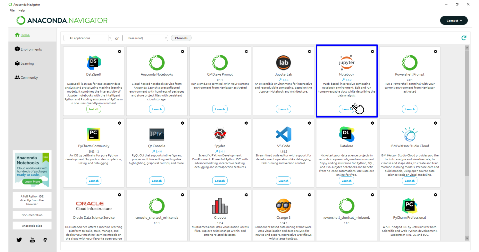
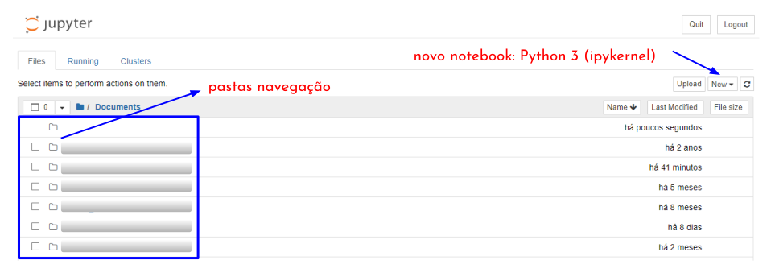

<h1>O que vamos ver?!</h1>

<p align = "justify">
Este é o curso de Métodos Computacionais parte 1 (<i>MCOMP0001</i>) e tem como objetivo central oferecer aos alunos uma introdução a programação em <b>Python</b> que será a linguagem empregada ao longo de todo o curso.<br><br>

Este curso é ministrado pelo professor <a href="http://lattes.cnpq.br/2268506213083114" target = "_blank" rel = "noopener noreferrer">Wanderlei Junior</a> e também foi construído com ajuda de diversos alunos do grupo de pesquisa GPEE.<br><br>

Nesta etapa que chamaremos pelo código <i>MCOMP1</i> será destinado um espaço para o seguinte conteúdo:
</p>

<table>
  <tr>
    <td style = "width:70%;">
        <ol>
            <li>Introdução à lógica;</li>
            <li>Expressões e operadores;</li>
            <li>Estrutras de controle;</li>
            <li>Estrutras homogêneas;</li>
            <li>Estrutras especiais;</li>
            <li>Manipulação de arquivos;</li>
            <li>Paradigmas.</li>
        </ol>
    </td>
    <td style = "width:30%;"><center></center></td>
  </tr>
</table>

<h1>Instalação ferramenta</h1>

<p align = "justify">
Vamos iniciar o curso pela instalação da linguagem de programação e dos ambientes que que devem/podem ser utilizados ao longo do curso. A lista não é extensa porém vamos fazer uso destas ferramentas para facilitar o nosso desempenho no curso.
</p>

<ol>
    <li><a href="https://www.anaconda.com/download" target = "_blank" rel = "noopener noreferrer">Anaconda <i>Environment</i></a>;</li>
</ol>

<p align = "justify">
Com todas as ferramentas instaladas e testadas iniciamos então o curso pelo famoso <i>Hello Word</i>. Antes disso vamos testar o ambiente <b>Anaconda Navigator</b>. Nas nossas aplicações vamos usar a IDE (<i>Integrated Development Environment</i>) notebook <b>Jupyter</b>. Esse ambiente é bastante prático pois fornece suporte para linguagem além de permitir anotações em formato de linguagem de marcação <b>Markdown</b>.<br><br>
A <a href = "#fig11">Figura 1.1</a> apresenta uma imagem da posição da IDE notebook <b>Jupyter</b> na plataforma <b>Anaconda Navigator</b>. 
</p>

<p align = "left" id = "fig11"><b>Figura 1.1</b> <i>Home</i> da plataforma <b>Anaconda Navigator</b>.</p>
<center></center>

<h2>Um pouco sobre o uso da IDE notebook Jupyter</h2>

<p align = "justify">
O notebook Jupyter é muito parecido com um caderno digital. Ele permite que você faça seus códigos e tambpem comentários usando a linguagem Markdown. Você pode acessar o conteúdo de <a href="http://cursos.leg.ufpr.br/prr/capMarkdown.html" target = "_blank" rel = "noopener noreferrer">Mayer e Zeviani</a> <a href = "#ref1">[1]</a> para entender um pouco do funcionamento desta linguagem de marcação. 
</p>

<p align = "justify">
Ao abrir o ambiente notebook Jupyter podemos criar um novo notebook conforme indicação na <a href = "#fig12">Figura 1.2</a> e então poderemos utilizar a linguagem Python.
</p>

<p align = "left" id = "fig12"><b>Figura 1.2</b> Tela inicial notebook Jupyter.</p>
<center></center>

<h1>Um pouco sobre a linguagem</h1>

<p align = "justify">
Pode-se dizer que o Python é uma liguagem meio compilada e meio interpretada. A parte da compilação fica escondida do programador. Não iremos abordar isso no curso mas para ficar mais claro linguagens interpretadas são aquelas em que o código fonte é lido linha por linha e executado diretamente pelo interpretador em tempo de execução. O interpretador traduz cada instrução ou bloco de instruções para código de máquina em tempo real e executa-o imediatamente.
</p>

<p align = "justify">
Além disso vale comentar que o Python é uma linguagem de tipagem dinâmica e forte. A tipagem dinâmica permite que você altere o tipo da variável em tempo de execução. O Python detectará automaticamente o tipo da variável e atribuirá o tipo. Vejamos um exemplo: 
</p>

```python
valor = 'wanderlei'

print('tipo :', type(valor))

valor = 12

print('tipo :', type(valor))

valor = 12.45

print('tipo :', type(valor))
```

```cmd
tipo : <class 'str'>
tipo : <class 'int'>
tipo : <class 'float'>
```

<p align = "justify">
Já a tipagem forte diz respeito ao padrão conversão para realizar operações. Por exemplo se em Python tentarmos somar um nome com um valor inteiro, essa soma não será possível sendo retornado um erro na interface. Vejamos um exemplo:
</p>

```python
nome = 'Wanderlei Junior'
idade = 33

print(nome + " " + idade)
```

```cmd
---------------------------------------------------------------------------
TypeError                                 Traceback (most recent call last)
Cell In[3], line 4
      1 nome = "Wanderlei Junior"
      2 idade = 33
----> 4 print(nome + " " + idade)

TypeError: can only concatenate str (not "int") to str
```

{: .note }
> Em outras linguagens como o JavaScript a linguagem faria a uma conversão implícita e a combinação `Wanderlei Junior 33` iria aparecer no console.

<h1>Referências</h1>

<table>
    <thead>
        <tr>
            <th>Código</th>
            <th>Referência</th>
        </tr>
    </thead>
    <tbody>
        <tr>
            <td><p align = "center" id = "ref1">[1]</p></td>
            <td><p align = "left">Mayer F, Zeviani W. Markdown e Pandoc 2023. http://cursos.leg.ufpr.br/prr/capMarkdown.html.</p></td>
        </tr>
    </tbody>
</table>